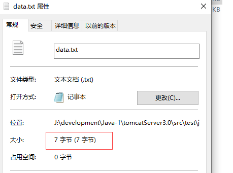
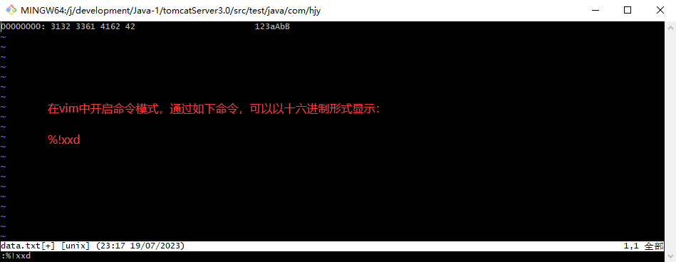

## Linux 习题集
### mkdir
```shell
mkdir --parents parent/child  父目录不存在时自动创建父目录
mkdir --mode=777 oppo         创建oppo目录，设置目录权限为777
```
### 重定向问题
* 输出重定向
```shell
[harrdy@localhost test]$ echo 'Hello World!!!' > test.txt
[harrdy@localhost test]$ cat test.txt
Hello World!!!
#追加
[harrdy@localhost test]$ echo 'Hello World!!!' >> test.txt
[harrdy@localhost test]$ cat test.txt
Hello World!!!
Hello World!!!
```
* 输入重定向 本来需要从键盘获取输入的命令会转移到文件读取内容
```shell
[harrdy@localhost test]$ wc -l < test.txt
2
[harrdy@localhost test]$ cat < test.txt
Hello World!!!
Hello World!!!
```
* 输入输出重定向
```
command1 < infile > outfile
同时替换输入和输出，执行command1，从文件infile读取内容，然后将输出写入到outfile中
```
* 重定向到 /dev/null 禁止输出
```shell
[harrdy@localhost test]$ cat test.txt
Hello World!!!
Hello World!!!
[harrdy@localhost test]$ cat test.txt > /dev/null 
```
```shell
#一般情况下，每个 Unix/Linux 命令运行时都会打开三个文件：
#标准输入文件(stdin)：stdin的文件描述符为0，Unix程序默认从stdin读取数据。
#标准输出文件(stdout)：stdout 的文件描述符为1，Unix程序默认向stdout输出数据。
#标准错误文件(stderr)：stderr的文件描述符为2，Unix程序会向stderr流中写入错误信息。
#默认情况下，command > file 将 stdout 重定向到 file，command < file 将stdin 重定向到 file。

[harrdy@localhost test]$ find ./ -name "*.txt" 
./test.txt
./test2.txt
./error.txt
[harrdy@localhost test]$ find ./ -names "*.txt" 
find: unknown predicate `-names'
[harrdy@localhost test]$ find ./ -names "*.txt" > error
find: unknown predicate `-names'
#2>&1 表示将标准错误输出也重定向到标准输出中
[harrdy@localhost test]$ find ./ -names "*.txt" > error 2>&1
[harrdy@localhost test]$ cat error
find: unknown predicate `-names'
```
### xargs
* xargs 是一个强有力的命令，它能够捕获一个命令的输出，然后传递给另外一个命令。
* 之所以能用到这个命令，关键是由于很多命令不支持|管道来传递参数，而日常工作中有有这个必要，所以就有了 xargs 命令
* xargs 一般是和管道一起使用。
* -n num 后面加次数，表示命令在执行的时候一次用的argument的个数，默认是用所有的。
```shell
[harrdy@localhost test]$ cat test.txt 
a b c d e f g
h i j k l m n
o p q
r s t
u v w x y z
[harrdy@localhost test]$ cat test.txt | xargs 
a b c d e f g h i j k l m n o p q r s t u v w x y z
[harrdy@localhost test]$ cat test.txt | xargs -n 4
a b c d
e f g h
i j k l
m n o p
q r s t
u v w x
y z
[harrdy@localhost test]$ cat test.txt | xargs -n 10
a b c d e f g h i j
k l m n o p q r s t
u v w x y z
```
* 批量删除当前目录下后缀名为.c的文件。如a.c、b.c
```shell
rm *.c
[harrdy@localhost test]$ find . -maxdepth 1 -name "*.txt" | xargs
./test2.txt ./error.txt ./test.txt
[harrdy@localhost test]$ find . -maxdepth 1 -name "*.txt" | xargs rm
```
### vim编辑器
* 定位
```shell
nG                        命令模式定位到n行
vim file +20              vim命令中定位，所以打开的时候就定位到了第20行
vim file +                命令模式定位到文件的尾部
G	                      移动到这个档案的最后一行
nG	                      n 为数字。移动到这个档案的第 n 行
gg	                      移动到这个档案的第一行，相当于 1G 啊！
n<Enter>	              n 为数字。光标向下移动 n 行
```
* 删除复制粘贴
```shell
#删除 命令模式
dd                        删除当前行
ndd                       删除当前行开始的连续n行
#删除 底线命令模式(:)
:n1,n2d                   删除n1到n2行，例如删除1到10行1,10d
:n,$d                     删除从某行开始至文本末尾，例如删除第8行至末尾 8,$d
#复制 命令模式
yy                        复制当前行
nyy	                      复制当前行开始的连续n行
#粘贴 命令模式
p,P	                      p为将已复制的数据在光标下一行贴上，P 则为贴在游标上一行
```
### tar
```shell
-v 详细报告tar处理的文件信息。如无此选项，tar不报告文件信息。
-z 用gzip来压缩/解压缩文件，加上该选项后可以将档案文件进行压缩，但还原时也一定要使用该选项进行解压缩。
-f 指定档案文件名或设备名
-x 从档案文件中释放文件(解包)
-c 创建新的档案文件(打包)

打包+压缩
tar -zcvf file.tar.gz file.txt
解压缩+解包
tar -zxvf file.tar.gz
```
### ```vim```查看文件在内存中的样子
```shell
# cat data.txt
123aAbB
```
#### 查看大小7字节

---

#### ```vim```二进制打开

---

```shell
# 可以看到 16进制(1字节)与文件内容对应关系
31->1
32->2
33->3
61->a
41->A
62->b
42->B
## 一共7字节
```