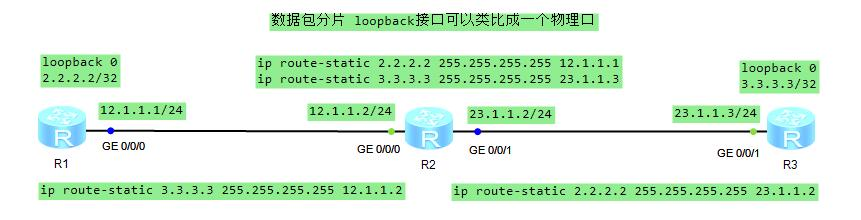

* 原始报文
```sh
# eth
54 89 98 d5 21 52
54 89 98 84 13 bc
08 00
# IPv4 首部长度5*4=20字节 首部+数据部分=0x03e8=1000字节
# identification=0x000f=15 DF=0(可以分片) MF=0(没有剩余分片报文) 0ffset=0
# header checksum=0xadfc
45 00 03 e8
00 0f 00 00
ff 01 ad fc
02 02 02 02
03 03 03 03
```
* 设置路由器出接口 mtu=500
* 第一片
```sh
# eth
54 89 98 d5 21 52
54 89 98 84 13 bc
08 00
# IPv4 首部长度5*4=20字节 首部+数据部分=0x01f4=500字节
# identification=0x000f=15 DF=0(可以分片) MF=1(有剩余分片报文) 0ffset=0
# header checksum=0x90f0
45 00 01 f4
00 0f 20 00
fe 01 90 f0
02 02 02 02
03 03 03 03
```
* 第二片
```sh
# eth
54 89 98 d5 21 52
54 89 98 84 13 bc
08 00
# IPv4 首部长度5*4=20字节 首部+数据部分=0x01f4=500字节
# identification=0x000f=15 DF=0(可以分片) MF=1(有剩余分片报文) 0ffset=0x3c*8=480
# header checksum=0x90b4
45 00 01 f4
00 0f 20 3c
fe 01 90 b4
02 02 02 02
03 03 03 03
```
* 第三片
```sh
# eth
54 89 98 d5 21 52
54 89 98 84 13 bc
08 00
# IPv4 首部长度5*4=20字节 首部+数据部分=0x0028=40字节
# identification=0x000f=15 DF=0(可以分片) MF=0(没有剩余分片报文) 0ffset=0x78*8=960
# header checksum=0x90b4
45 00 00 28
00 0f 00 78
fe 01 b2 44
02 02 02 02
03 03 03 03
```