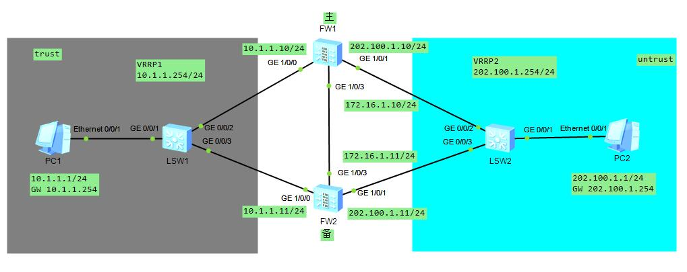

### hot standby 双机热备

#### 工作模式
* 防火墙工作在三层 上下连接交换机 主备模式
#### 配置教程
* 一、基本配置
```sh
# 主墙                                            #备墙
# 接口配置
interface GigabitEthernet1/0/0
 ip address 10.1.1.10 255.255.255.0               ip address 10.1.1.11 255.255.255.0
interface GigabitEthernet1/0/3
 ip address 172.16.1.10 255.255.255.0             ip address 172.16.1.11 255.255.255.0
interface GigabitEthernet1/0/1
 ip address 202.100.1.10 255.255.255.0            ip address 202.100.1.11 255.255.255.0
# 安全域 主墙同备墙
trust    GigabitEthernet1/0/0
dmz      GigabitEthernet1/0/3
untrust  GigabitEthernet1/0/1
```
* 二、双机热备配置
```sh
# 主墙 vrrp  VRRP主设备加入到VGMP active组
interface GigabitEthernet1/0/0
 vrrp vrid 1 virtual-ip 10.1.1.254 active
interface GigabitEthernet1/0/1
 vrrp vrid 2 virtual-ip 202.100.1.254 active
# 备墙 vrrp VRRP备设备加入到VGMP standby组
interface GigabitEthernet1/0/0
 vrrp vrid 1 virtual-ip 10.1.1.254 standby
interface GigabitEthernet1/0/1
 vrrp vrid 2 virtual-ip 202.100.1.254 standby
# 心跳接口配置
[FW1]display current-configuration | inc hrp
 hrp interface GigabitEthernet1/0/3 remote 172.16.1.11
[FW2]display current-configuration | inc hrp
 hrp interface GigabitEthernet1/0/3 remote 172.16.1.10
# 放行心跳流量通过
[FW1]ip service-set hrp type object
[FW1-object-service-set-hrp]service protocol udp source-port 65280 destination-port 18514 to 18515
[FW2]ip service-set hrp type object
[FW2-object-service-set-hrp]service protocol udp source-port 65280 destination-port 18514 to 18515
# 心跳报文安全策略
[FW1]display security-policy rule name hrp1
 rule name hrp1
  source-zone local
  destination-zone dmz
  source-address 172.16.1.10 mask 255.255.255.255
  destination-address 172.16.1.11 mask 255.255.255.255
  service hrp
  action permit
[FW1]display security-policy rule name hrp2
 rule name hrp2
  source-zone dmz
  destination-zone local
  source-address 172.16.1.11 mask 255.255.255.255
  destination-address 172.16.1.10 mask 255.255.255.255
  service hrp
  action permit

[FW2]display security-policy rule name hrp1
 rule name hrp1
  source-zone local
  destination-zone dmz
  source-address 172.16.1.11 mask 255.255.255.255
  destination-address 172.16.1.10 mask 255.255.255.255
  service hrp
  action permit
[FW2]display security-policy rule name hrp2
 rule name hrp2
  source-zone dmz
  destination-zone local
  source-address 172.16.1.10 mask 255.255.255.255
  destination-address 172.16.1.11 mask 255.255.255.255
  service hrp
  action permit
# 模拟器开启双机热备(与真机不同)
[FW1]hrp enable   变化名称 HRP_M[FW1]
[FW2]hrp enable   变化名称 HRP_S[FW2]
[FW2]hrp standby-device
```
#### 实验验证
* 查看会话
```sh
HRP_M[FW1]display firewall session table
 udp  VPN: public --> public  172.16.1.11:49152 --> 172.16.1.10:18514
 udp  VPN: public --> public  172.16.1.10:49152 --> 172.16.1.11:18514
 udp  VPN: public --> public  172.16.1.11:16384 --> 172.16.1.10:18514
HRP_S[FW2]display firewall session table
 udp  VPN: public --> public  172.16.1.11:49152 --> 172.16.1.10:18514
 udp  VPN: public --> public  172.16.1.10:49152 --> 172.16.1.11:18514
 udp  VPN: public --> public  172.16.1.10:16384 --> 172.16.1.11:18514
```
* 查看hrp状态
```sh
HRP_M[FW1]display hrp state
2021-02-22 16:43:00.840
 Role: active, peer: standby
 Running priority: 45000, peer: 45000
 Backup channel usage: 0.00%
 Stable time: 0 days, 0 hours, 13 minutes
 Last state change information: 2021-02-22 16:30:24 HRP core state changed, old_
state = abnormal(active), new_state = normal, local_priority = 45000, peer_prior
ity = 45000.
HRP_M[FW1]display hrp interface
2021-02-22 16:45:52.370
             GigabitEthernet1/0/3 : running
```
* 查看VRRP状态
```sh
HRP_M[FW1]display vrrp interface GigabitEthernet 1/0/0
2021-02-22 16:44:47.390
  GigabitEthernet1/0/0 | Virtual Router 1
    State : Master
    Virtual IP : 10.1.1.254
    Master IP : 10.1.1.10
    PriorityRun : 120
    PriorityConfig : 100
    MasterPriority : 120
    Preempt : YES   Delay Time : 0 s
    TimerRun : 60 s
    TimerConfig : 60 s
    Auth type : NONE
    Virtual MAC : 0000-5e00-0101
    Check TTL : YES
    Config type : vgmp-vrrp
    Backup-forward : disabled
    Create time : 2021-02-22 14:55:07
    Last change time : 2021-02-22 15:25:18
```
* 主墙配置安全策略备墙同步
```sh
HRP_M[FW1-policy-security]rule name lktest (+B)
HRP_S[FW2]display security-policy rule all
RULE ID  RULE NAME                         STATE      ACTION       HITS
-------------------------------------------------------------------------------
1        hrp1                              enable     permit       0
2        hrp2                              enable     permit       0
3        trust_untrust_permit              enable     permit       0
4        mytest                            enable     -            0
5        lktest                            enable     -            0
0        default                           enable     deny         0
-------------------------------------------------------------------------------
```
* PC1 长ping PC2 中断业务
```sh
# 主墙配置安全策略备墙同步
security-policy
 rule name trust_untrust_permit
  source-zone trust
  destination-zone untrust
  source-address 10.1.1.0 mask 255.255.255.0
  destination-address 202.100.1.0 mask 255.255.255.0
  action permit
# 长ping PC1>ping 202.100.1.1 -t 会话同步
HRP_M[FW1]display firewall session table
HRP_S[FW2]display firewall session table
# 断开 FW1 主墙 GE 1/0/0 口,业务不中断
    HRP_M[FW1-GigabitEthernet1/0/0]shutdown
    ## 主备相互切换，由新的主墙进行业务
# 恢复中断
HRP_S[FW1-GigabitEthernet1/0/0]dis this
interface GigabitEthernet1/0/0
 shutdown
 ip address 10.1.1.10 255.255.255.0
 vrrp vrid 1 virtual-ip 10.1.1.254 active
HRP_S[FW1-GigabitEthernet1/0/0]undo shutdown
   ## 过一会 主备相互切换，由新的主墙进行业务
```
* 双机热备默认自动同步，测试手动同步
```sh
# 关掉主墙自动同步功能
HRP_M[FW1]undo hrp auto-sync connection-status
    ## 主墙新产生的会话不会同步到备墙
# 长ping PC1>ping 202.100.1.1 -t
    ## 主墙新产生的会话不会同步到备墙
# 主机下发 使能自动同步功能
    ## hrp auto-sync connection-status是防火墙连接状态备份命令
    ## 使能了此命令后，防bai火墙都能将自己建立或刷新的会话备份到对端防火墙上
    ## 此命令行在防火墙hrp enable执行之后会默认使能。
HRP_M[FW1]hrp auto-sync connection-status
    ## 模拟器主墙新产生的会话同步到了备墙
# 真机上面会有下面命令
    ## 执行手工批量备份命令后，主用设备会立即同步一次可以备份的状态信息到备用设备，而不必等到自动备份周期的到来
    ## 手工批量备份主要适用于主备设备之间配置不同步，需要手工同步的场景
HRP_M[FW1]hrp sync connection-status
```