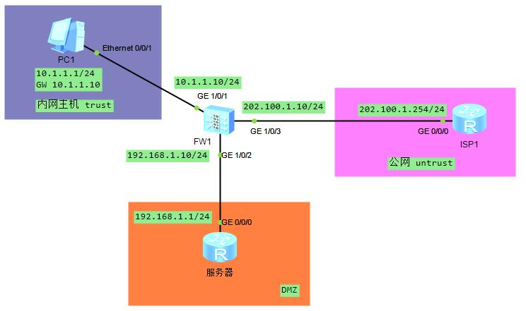

#### 源NAT

##### 环境配置
* 基本配置
```sh
# 接口基本配置
[FW1-GigabitEthernet1/0/1]dis this                      [server-GigabitEthernet0/0/0]dis this             [ISP1-GigabitEthernet0/0/0]dis this
 undo shutdown                                           ip address 192.168.1.1 255.255.255.0              ip address 202.100.1.254 255.255.255.0
 ip address 10.1.1.10 255.255.255.0
[FW1-GigabitEthernet1/0/2]dis this
 undo shutdown
 ip address 192.168.1.10 255.255.255.0
[FW1-GigabitEthernet1/0/3]dis this
 undo shutdown
 ip address 202.100.1.10 255.255.255.0
# 安全域配置
[FW1]display zone 
trust
    GigabitEthernet1/0/1
untrust
    GigabitEthernet1/0/3
dmz
    GigabitEthernet1/0/2
[FW1]
# 安全策略配置
[FW1]security-policy 
[FW1-policy-security]dis this
 default action permit

# PC 配置
10.1.1.1/24
GW 10.1.1.10

# ping 检查 usg ping PC/server/ISP1
display security-policy rule all # 每ping一种，hits++
```
* nat 配置
```sh
# 配置地址池、模式为 no-pat 模式，地址转换的时候不转换端口
[FW1]nat address-group no_pat
[FW1-address-group-no_pat]dis this
 mode no-pat global
 section 202.100.1.5 202.100.1.7
# 配置 nat-policy
[FW1]nat-policy
[FW1-policy-nat]rule name no_pat
[FW1-policy-nat-rule-no_pat]dis this
  source-zone trust
  destination-zone untrust
  source-address 10.1.1.0 mask 255.255.255.0
  action source-nat address-group no_pat
# 放行安全策略
[FW1]security-policy
[FW1-policy-security]rule name no_pat
[FW1-policy-security-rule-no_pat]dis this
  source-zone trust
  destination-zone untrust
  source-address 10.1.1.0 mask 255.255.255.0 # 无须配置目的地址
  action permit
```
* 测试 PC ping ISP1
```sh
[FW1]display security-policy rule all
Total:2 
RULE ID  RULE NAME                         STATE      ACTION       HITS        
------------------------------------------------------------------------------- 
1        no_pat                            enable     permit       5           
0        default                           enable     deny         3           
-------------------------------------------------------------------------------
[FW1]display nat-policy rule all
Total:2 
RULE ID  RULE NAME                         STATE      ACTION       HITS        
------------------------------------------------------------------------------- 
1        no_pat                            enable     src-nat      5           
0        default                           enable     no-nat       0           
-------------------------------------------------------------------------------
```
* server ping ISP1
```sh
[FW1]display security-policy rule name dmz_ISP                       [server]display current-configuration | inc  route-static
 rule name dmz_ISP                                                    ip route-static 0.0.0.0 0.0.0.0 192.168.1.10 # 相当于配一个网关
  source-zone dmz
  destination-zone untrust
  source-address 192.168.1.0 mask 255.255.255.0
  action permit
[FW1]display nat-policy rule name no_patB
 rule name no_patB
  source-zone dmz
  destination-zone untrust
  source-address 192.168.1.0 mask 255.255.255.0
  action source-nat address-group no_pat
# test
[FW1]display firewall session table 
 icmp  VPN: public --> public  10.1.1.1:14233[202.100.1.5:14233] --> 202.100.1.254:2048
 icmp  VPN: public --> public  10.1.1.1:13721[202.100.1.5:13721] --> 202.100.1.254:2048
 icmp  VPN: public --> public  10.1.1.1:13977[202.100.1.5:13977] --> 202.100.1.254:2048
 icmp  VPN: public --> public  192.168.1.1:54187[202.100.1.6:54187] --> 202.100.1.254:2048
 icmp  VPN: public --> public  10.1.1.1:14489[202.100.1.5:14489] --> 202.100.1.254:2048
```
##### 配置NAT后为什么要同时配置黑洞路由
* 公网上的一台PC主动访问防火墙上的NAT地址池地址(NAT地址池地址和公网接口地址在同一网段时)
```sh
[ISP1]ping -c 1 202.100.1.5
# 抓包发现，只抓到了三个ARP报文和一个ICMP request
# ARP request who has 202.100.1.5? Tell 202.100.1.254
# ARP reply 202.100.1.5 is at mac(GE1/0/3)
# ICMP request SIP:202.100.1.254 DIP:202.100.1.5
# USG ARP request who has 202.100.1.5? Tell 202.100.1.10
# 但是网络中其它设备都没有配置这个地址，肯定就不会回应，最终防火墙将报文丢弃。
# 但是如果公网上的捣乱分子发起大量访问时，防火墙将发送大量的ARP请求报文，也会消耗系统资源
# 所以，当防火墙上NAT地址池地址和公网接口地址在同一网段时，建议也配置黑洞路由，避免防火墙发送ARP请求报文，节省防火墙的系统资源。
[FW1]ip route-static 202.100.1.5 32 NULL 0 # 精确匹配，防止影响其他功能
```