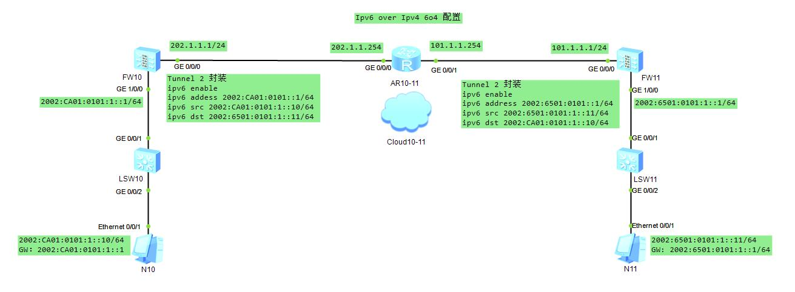

### Ipv6 over Ipv4 自动隧道

#### FW10 配置
* GigabitEthernet 0/0/0
```sh
[USG6000V1-GigabitEthernet0/0/0]dis this
 ip address 202.1.1.1 255.255.255.0
 undo service-manage enable
```
* Tunnel 2
```sh
[USG6000V1-Tunnel2]dis this
 ipv6 enable
 ipv6 address 2002:CA01:101::1/64
 tunnel-protocol ipv6-ipv4 6to4
 source GigabitEthernet0/0/0
 undo service-manage enable
```
* ipv6 全局使能 使 Tunnel up
* GigabitEthernet1/0/0
```sh
[USG6000V1-GigabitEthernet1/0/0]dis this
 undo shutdown
 ipv6 enable
 ipv6 address 2002:CA01:101:1::1/64
 undo service-manage enable
```
* 安全域
```sh
[USG6000V1]firewall zone trust 
[USG6000V1-zone-trust]dis this
 add interface GigabitEthernet0/0/0
 add interface GigabitEthernet1/0/0
 add interface Tunnel2
```
* 安全策略
```sh
[USG6000V1]security-policy 
[USG6000V1-policy-security]dis this
 default action permit
```
* 静态路由
```sh
[USG6000V1]display current-configuration | inc route-static
ip route-static 0.0.0.0 0.0.0.0 202.1.1.254 # 封装之后怎么走
ipv6 route-static 2002:6501:101:1:: 64 Tunnel2 # 引流
```

#### FW11 配置
* GigabitEthernet 0/0/0
```sh
[USG6000V1-GigabitEthernet0/0/0]dis this
 ip address 101.1.1.1 255.255.255.0
 undo service-manage enable
```
* Tunnel 2
```sh
[USG6000V1-Tunnel2]dis this
 ipv6 enable
 ipv6 address 2002:6501:101::1/64
 tunnel-protocol ipv6-ipv4 6to4
 source GigabitEthernet0/0/0
 undo service-manage enable
```
* ipv6 全局使能 使 Tunnel up
* GigabitEthernet1/0/0
```sh
[USG6000V1-GigabitEthernet1/0/0]dis this
 undo shutdown
 ipv6 enable
 ipv6 address 2002:6501:101:1::1/64
 undo service-manage enable
```
* 安全域
```sh
[USG6000V1]firewall zone trust 
[USG6000V1-zone-trust]dis this
 add interface GigabitEthernet0/0/0
 add interface GigabitEthernet1/0/0
 add interface Tunnel2
```
* 安全策略
```sh
[USG6000V1]security-policy 
[USG6000V1-policy-security]dis this
 default action permit
```
* 静态路由
```sh
[USG6000V1]display current-configuration | inc route-static
ip route-static 0.0.0.0 0.0.0.0 101.1.1.254 # 封装之后怎么走
ipv6 route-static 2002:CA01:101:1:: 64 Tunnel2 # 引流
```
#### 基本检查
* ping -a 202.1.1.1 101.1.1.1 (必须通，否则无隧道可言)
* 主机相互 ping
#### 基本命令
* display current-configuration | inc route-static
* display ipv6 interface brief (ipv6全局使能之后,查tunnel state)
* display ipv6 routing-table protocol static verbose