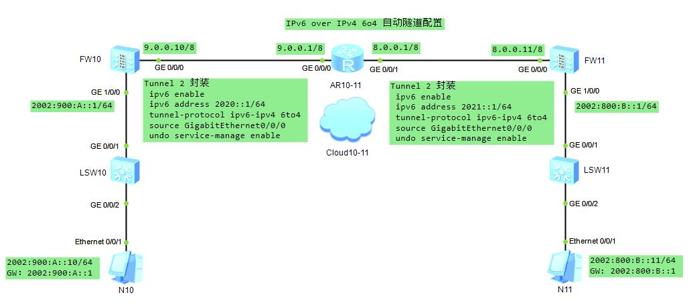

### Ipv6 over Ipv4 自动隧道

#### 配置教程
* 第一步 FW10 GE 0/0/0 ping FW11 GE 0/0/0
```sh
# 接口配置
[FW10-GigabitEthernet0/0/0]dis this                   [AR10-11-GigabitEthernet0/0/0]dis this             [FW11-GigabitEthernet0/0/0]dis this
 undo shutdown                                         ip address 9.0.0.1 255.0.0.0                       undo shutdown
 ip address 9.0.0.10 255.0.0.0                        [AR10-11-GigabitEthernet0/0/1]dis this              ip address 8.0.0.11 255.0.0.0
 undo service-manage enable                            ip address 8.0.0.1 255.0.0.0                       undo service-manage enable
# 安全域配置
[FW10]firewall zone trust                                                                                [FW11]firewall zone trust
[FW10-zone-trust]dis this                                                                                [FW11-zone-trust]dis this
 add interface GigabitEthernet0/0/0                                                                       add interface GigabitEthernet0/0/0
# 安全策略配置
[FW10]security-policy                                                                                    [FW11]security-policy
[FW10-policy-security]dis this                                                                           [FW11-policy-security]dis this
 default action permit                                                                                    default action permit
# 静态路由配置
[FW10]display current-configuration | inc route-static                                                   [FW11]display current-configuration | inc route-static
ip route-static 0.0.0.0 0.0.0.0 9.0.0.1                                                                  ip route-static 0.0.0.0 0.0.0.0 8.0.0.1
# ping 通检查
```
* 第二步 6o4 隧道配置
```sh
[FW10-Tunnel2]dis this                                   [FW11-Tunnel2]dis this
 ipv6 enable                                              ipv6 enable
 # 只能配IPv6 接口IP无实际意义
 ipv6 address 2020::1/64                                  ipv6 address 2021::1/64
 tunnel-protocol ipv6-ipv4 6to4                           tunnel-protocol ipv6-ipv4 6to4
 source GigabitEthernet0/0/0                              source GigabitEthernet0/0/0
 undo service-manage enable                               undo service-manage enable
# ipv6 全局使能 使 Tunnel up
[FW10]ipv6                                               [FW11]ipv6
# 查看 tunnel 接口是否 up
[FW10]display ipv6 interface brief                       [FW11]display ipv6 interface brief
# 安全域配置
[FW10]firewall zone trust                                [FW11]firewall zone trust
[FW10-zone-trust]dis this                                [FW11-zone-trust]dis this
 add interface GigabitEthernet0/0/0                       add interface GigabitEthernet0/0/0
 add interface Tunnel2                                    add interface Tunnel2
```
* 收尾
```sh
# 接口配置
[FW10-GigabitEthernet1/0/0]dis this                      [FW11-GigabitEthernet1/0/0]dis this
 undo shutdown                                            undo shutdown
 ipv6 enable                                              ipv6 enable
 ipv6 address 2002:900:A::1/64                          ipv6 address 2002:800:B::1/64
 undo service-manage enable                               undo service-manage enable
# 安全域配置
[FW10-zone-trust]dis this                                [FW11-zone-trust]dis this
 add interface GigabitEthernet0/0/0                       add interface GigabitEthernet0/0/0
 add interface GigabitEthernet1/0/0                       add interface GigabitEthernet1/0/0
 add interface Tunnel2                                    add interface Tunnel2
# PC N10                                                 PC N11
2002:900:A::10/64                                        2002:800:B::11/64
GW：2002:900:A::1                                        GW: 2002:800:B::1
# PC ping GW check
# 引流路由配置
[FW10]display current-configuration | inc route-static   [FW11]display current-configuration | inc route-static
ip route-static 0.0.0.0 0.0.0.0 9.0.0.1                  ip route-static 0.0.0.0 0.0.0.0 8.0.0.1
ipv6 route-static 2002:800:B:: 64 Tunnel2                ipv6 route-static 2002:900:A:: 64 Tunnel2
# PC N10 ping PC N11 check
# 完结撒花
```
#### 基本检查
* ping -a 9.0.0.10 8.0.0.11 (必须通，否则无隧道可言)
* 主机相互 ping
#### 基本命令
* display current-configuration | inc route-static
* display ipv6 interface brief (ipv6全局使能之后,查tunnel state)
* display ipv6 routing-table protocol static verbose