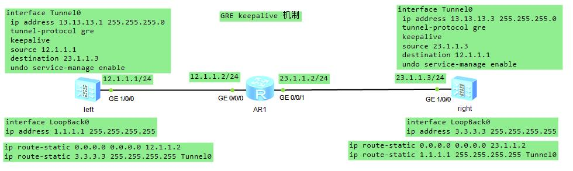

### GRE keepalive 机制

####
* Tunnel 口下使能 keepalive 默认5秒发一次 keepalive 报文 ```keepalive enable period 5 retry-times 3```
* left 防火墙tunnel上配置 keepalive left 每过5秒发一次ka报文，每发一次都会收到一个
```sh
[left-Tunnel0]display keepalive packets count
Send 12429 keepalive packets to peers, Receive 12429 keepalive response packets from peers
Receive 210 keepalive packets from peers, Send 210 keepalive response packets to peers.
```
* ka 报文分析
```
left 接口 GE 1/0/0 先发出ka报文
                                GRE Type=0x0000
                        IP Src=23.1.1.3 Dst=12.1.1.1 Protocol=GRE(47)
                GRE Type=IP(0x0800)
        IP Src=12.1.1.1 Dst=23.1.1.3 Protocol=GRE(47)
Dmac=AR1(GE 0/0/0) Smac=left(GE 1/0/0) Type=Ip(0x0800)

路过AR1 GE 0/0/1 发出
                                GRE Type=0x0000
                        IP Src=23.1.1.3 Dst=12.1.1.1 Protocol=GRE(47)
                GRE Type=IP(0x0800)
        IP Src=12.1.1.1 Dst=23.1.1.3 Protocol=GRE(47)
Dmac=right(GE 1/0/0) Smac=AR1(GE 0/0/1) Type=Ip(0x0800)

ka报文到达 right GE 1/0/0 之后，GRE解封装，由于里层IP地址相反，不上送，直接走转发
right GE 1/0/0 出接口ka报文
                GRE Type=0x0000
        IP Src=23.1.1.3 Dst=12.1.1.1 Protocol=GRE(47)
Dmac=AR1(GE 0/0/1) Smac=right(GE 1/0/0) Type=Ip(0x0800)

路过AR1，到达left GE 1/0/0 收到ka报文
                GRE Type=0x0000
        IP Src=23.1.1.3 Dst=12.1.1.1 Protocol=GRE(47)
Dmac=left(GE 1/0/0) Smac=AR1(GE 0/0/0) Type=Ip(0x0800)
```