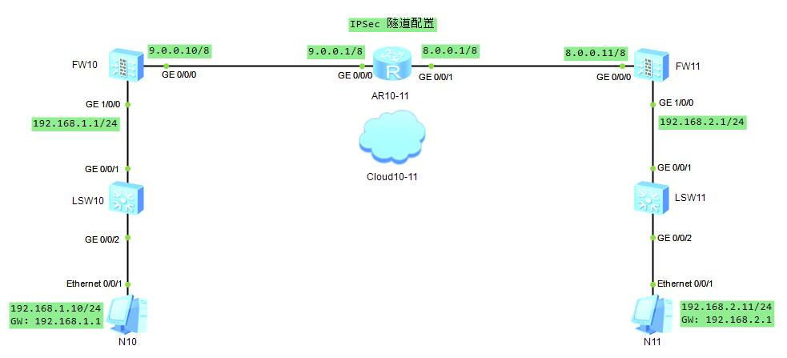

### IPSec 隧道配置

#### FW10 FW11 基本配置
* FW10 GE 0/0/0 ping FW11 GE 0/0/0
```sh
# 接口配置
[FW10-GigabitEthernet0/0/0]dis this                   [AR10-11-GigabitEthernet0/0/0]dis this             [FW11-GigabitEthernet0/0/0]dis this
 undo shutdown                                         ip address 9.0.0.1 255.0.0.0                       undo shutdown
 ip address 9.0.0.10 255.0.0.0                        [AR10-11-GigabitEthernet0/0/1]dis this              ip address 8.0.0.11 255.0.0.0
 undo service-manage enable                            ip address 8.0.0.1 255.0.0.0                       undo service-manage enable
# 安全域配置
[FW10]firewall zone trust                                                                                [FW11]firewall zone trust
[FW10-zone-trust]dis this                                                                                [FW11-zone-trust]dis this
 add interface GigabitEthernet0/0/0                                                                       add interface GigabitEthernet0/0/0
# 安全策略配置
[FW10]security-policy                                                                                    [FW11]security-policy
[FW10-policy-security]dis this                                                                           [FW11-policy-security]dis this
 default action permit                                                                                    default action permit
# 静态路由配置
[FW10]display current-configuration | inc route-static                                                   [FW11]display current-configuration | inc route-static
ip route-static 0.0.0.0 0.0.0.0 9.0.0.1                                                                  ip route-static 0.0.0.0 0.0.0.0 8.0.0.1
# ping 通检查
```
#### IPSec 第一阶段的配置
* ike 提议的配置
```sh
[FW10]ike proposal 10                                       [FW11]ike proposal 11
# 基本命令
display ike proposal number 10 # 根据序号去查ike提议
display ike proposal # 查看ike所有提议
display ike proposal default # 查看ike默认提议
```
* ike 对等体的配置
```sh
[FW10]ike peer fw11                                        [FW11]ike peer fw10
[FW10-ike-peer-fw11]dis this                               [FW11-ike-peer-fw10]
 undo version 2                                             undo version 2 # 使用 ike v1 版本
 pre-shared-key Huawei@123                                  pre-shared-key Huawei@123 # 不配 ping 不通
 ike-proposal 10                                            ike-proposal 11 # 调用 ike 提议
 remote-address 8.0.0.11                                    remote-address 9.0.0.10 # 指定远端地址
# 基本命令
display ike peer brief # 查看 ike 对等体简要信息
display ike peer name fw11 # 根据 ike name 查看详细信息
```
#### IPSec 第二阶段的配置
* 配置感兴趣流 注意 在ike v1版本中双方感兴趣流一定要互为镜像
```sh
[FW10]display acl 3000
 rule permit ip source 9.0.0.0 0.255.255.255 destination 8.0.0.0 0.255.255.255
[FW11]display acl 3000
 rule permit ip source 8.0.0.0 0.255.255.255 destination 9.0.0.0 0.255.255.255
```
* 配置 IPSec 安全提议
```sh
[FW10]ipsec proposal fw10IPSec                            [FW11]ipsec proposal fw11IPSec
# 基本命令
display ipsec proposal brief
display ipsec proposal name fw10IPSec # 包含封装模式、传输模式信息
```
* 配置 IPSec 策略
```sh
[FW10]ipsec policy fw10Policy 1 isakmp                    [FW11]ipsec policy fw11Policy 1 isakmp
[FW10-ipsec-policy-isakmp-fw10Policy-1]dis this           [FW11-ipsec-policy-isakmp-fw11Policy-1]dis this
 security acl 3000                                         security acl 3000
 ike-peer fw11                                             ike-peer fw10
 proposal fw10IPSec                                        proposal fw11IPSec
# 基本命令
display ipsec policy brief
display ipsec policy name fw11Policy
```
* 在物理接口上调用
```sh
[FW10-GigabitEthernet0/0/0]dis this                       [FW11-GigabitEthernet0/0/0]dis this
 undo shutdown                                             undo shutdown
 ip address 9.0.0.10 255.0.0.0                             ip address 8.0.0.11 255.0.0.0
 undo service-manage enable                                undo service-manage enable
 ipsec policy fw10Policy                                   ipsec policy fw11Policy
```
#### 收尾
```sh
# 接口配置
[FW10-GigabitEthernet1/0/0]dis this                      [FW11-GigabitEthernet1/0/0]dis this
 undo shutdown                                            undo shutdown
 ip address 192.168.1.1 255.255.255.0                     ip address 192.168.2.1 255.255.255.0
 undo service-manage enable                               undo service-manage enable
# 安全域配置
[FW10-zone-trust]dis this                                [FW11-zone-trust]dis this
 add interface GigabitEthernet0/0/0                       add interface GigabitEthernet0/0/0
 add interface GigabitEthernet1/0/0                       add interface GigabitEthernet1/0/0
# PC N10                                                 PC N11
192.168.1.10/24                                          192.168.2.11/24
GW：192.168.1.1                                          GW: 192.168.2.1
# PC ping GW check
# 引流路由配置
[FW10]display current-configuration | inc route-static   [FW11]display current-configuration | inc route-static
ip route-static 0.0.0.0 0.0.0.0 9.0.0.1                  ip route-static 0.0.0.0 0.0.0.0 8.0.0.1
# PC N10 ping PC N11 check
display ike sa
display ipsec sa
display ipsec statistics
# 完结撒花
```