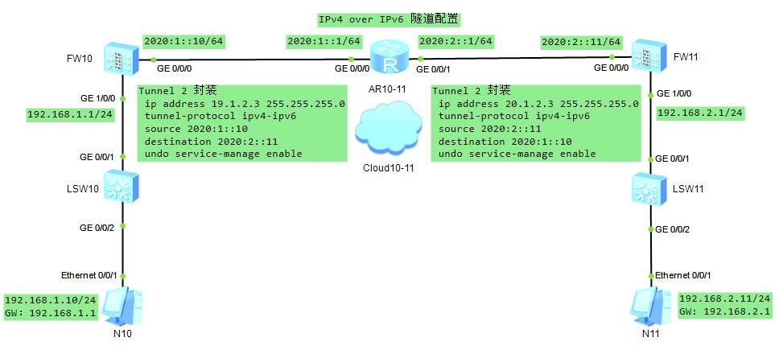

### Ipv4 over Ipv6 手动隧道

#### FW10 配置
* 第一步 FW10 GE 0/0/0 ping FW11 GE 0/0/0
```sh
# 接口配置
[FW10-GigabitEthernet0/0/0]dis this                   [AR10-11-GigabitEthernet0/0/0]dis this             [FW11-GigabitEthernet0/0/0]dis this
 undo shutdown                                         ipv6 enable                                        undo shutdown
 ipv6 enable                                           ipv6 address 2020:1::1/64                          ipv6 enable
 ipv6 address 2020:1::10/64                           [AR10-11-GigabitEthernet0/0/1]dis this              ipv6 address 2020:2::11/64
 undo service-manage enable                            ipv6 enable                                        undo service-manage enable
[FW10]ipv6                                             ipv6 address 2020:2::1/64                         [FW11]ipv6
                                                      [AR10-11]ipv6
# 安全域配置
[FW10]firewall zone trust                                                                                [FW11]firewall zone trust
[FW10-zone-trust]dis this                                                                                [FW11-zone-trust]dis this
 add interface GigabitEthernet0/0/0                                                                       add interface GigabitEthernet0/0/0
# 安全策略配置
[FW10]security-policy                                                                                    [FW11]security-policy
[FW10-policy-security]dis this                                                                           [FW11-policy-security]dis this
 default action permit                                                                                    default action permit
# 静态路由配置
[FW10]display current-configuration | inc route-static                                                   [FW11]display current-configuration | inc route-static
ipv6 route-static :: 0 2020:1::1                                                                         ipv6 route-static :: 0 2020:2::1
# ping 通检查
```
* 第二步 IPv4 over IPv6 手动隧道配置
```sh
[FW10-Tunnel2]dis this                                   [FW11-Tunnel2]dis this
 # 接口IP无实际意义，任意IP                               # 接口IP无实际意义，任意IP
 ip address 19.1.2.3 255.255.255.0                        ip address 20.1.2.3 255.255.255.0 
 tunnel-protocol ipv4-ipv6                                tunnel-protocol ipv4-ipv6
 source 2020:1::10                                        source 2020:2::11
 destination 2020:2::11                                   destination 2020:1::10
 undo service-manage enable                               undo service-manage enable
# 查看 tunnel 接口是否 up
[FW10]display ip interface brief                         [FW11]display ip interface brief
# 安全域配置
[FW10]firewall zone trust                                [FW11]firewall zone trust
[FW10-zone-trust]dis this                                [FW11-zone-trust]dis this
 add interface GigabitEthernet0/0/0                       add interface GigabitEthernet0/0/0
 add interface Tunnel2                                    add interface Tunnel2
```
* 收尾
```sh
# 接口配置
[FW10-GigabitEthernet1/0/0]dis this                      [FW11-GigabitEthernet1/0/0]dis this
 undo shutdown                                            undo shutdown
 ip address 192.168.1.1 255.255.255.0                     ip address 192.168.2.1 255.255.255.0
 undo service-manage enable                               undo service-manage enable
# 安全域配置
[FW10-zone-trust]dis this                                [FW11-zone-trust]dis this
 add interface GigabitEthernet0/0/0                       add interface GigabitEthernet0/0/0
 add interface GigabitEthernet1/0/0                       add interface GigabitEthernet1/0/0
 add interface Tunnel2                                    add interface Tunnel2
# PC N10                                                 PC N11
192.168.1.10/24                                          192.168.2.11/24
GW：192.168.1.1                                          GW: 192.168.2.1
# PC ping GW check
# 引流路由配置
[FW10]display current-configuration | inc route-static   [FW11]display current-configuration | inc route-static
ip route-static 192.168.2.0 255.255.255.0 Tunnel2        ip route-static 192.168.1.0 255.255.255.0 Tunnel2
ipv6 route-static :: 0 2020:1::1                         ipv6 route-static :: 0 2020:2::1
# PC N10 ping PC N11 check
# 完结撒花
```