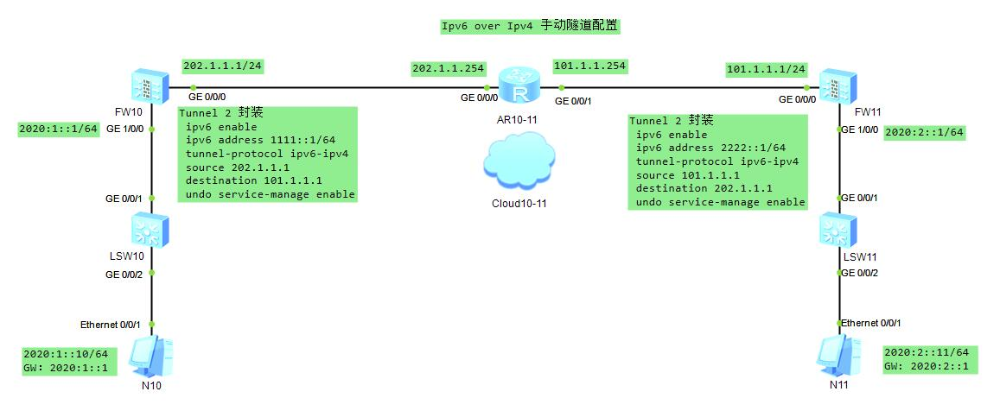

### Ipv6 over Ipv4 手动隧道

#### FW10 配置
* 第一步 FW10 GE 0/0/0 ping FW11 GE 0/0/0
```sh
# 接口配置
[FW10-GigabitEthernet0/0/0]dis this                   [AR10-11-GigabitEthernet0/0/0]dis this             [FW11-GigabitEthernet0/0/0]dis this
 undo shutdown                                         ip address 202.1.1.254 255.255.255.0               undo shutdown
 ip address 202.1.1.1 255.255.255.0                   [AR10-11-GigabitEthernet0/0/1]dis this              ip address 101.1.1.1 255.255.255.0
 undo service-manage enable                            ip address 101.1.1.254 255.255.255.0               undo service-manage enable
# 安全域配置
[FW10]firewall zone trust                                                                                [FW11]firewall zone trust
[FW10-zone-trust]dis this                                                                                [FW11-zone-trust]dis this
 add interface GigabitEthernet0/0/0                                                                       add interface GigabitEthernet0/0/0
# 安全策略配置
[FW10]security-policy                                                                                    [FW11]security-policy
[FW10-policy-security]dis this                                                                           [FW11-policy-security]dis this
 default action permit                                                                                    default action permit
# 静态路由配置
[FW10]display current-configuration | inc route-static                                                   [FW11]display current-configuration | inc route-static
ip route-static 0.0.0.0 0.0.0.0 202.1.1.254                                                              ip route-static 0.0.0.0 0.0.0.0 101.1.1.254
# ping 通检查
```
* 第二步 IPv6 over IPv4 手动隧道配置
```sh
# tunnel 协议端口 up 条件
# tunnel 自身IP地址必须是IPv6
# 系统视图下 ipv6 使能
[FW10-Tunnel2]dis this                                   [FW11-Tunnel2]dis this
 ipv6 enable                                              ipv6 enable
 ipv6 address 1111::1/64                                  ipv6 address 2222::1/64
 tunnel-protocol ipv6-ipv4                                tunnel-protocol ipv6-ipv4
 source 202.1.1.1                                         source 101.1.1.1
 destination 101.1.1.1                                    destination 202.1.1.1
 undo service-manage enable                               undo service-manage enable
# 系统视图 使能 ipv6
[FW10]ipv6                                               [FW11]ipv6
# 查看 tunnel 接口是否 up
[FW10]display ipv6 interface brief                       [FW11]display ipv6 interface brief
# 安全域配置
[FW10]firewall zone trust                                [FW11]firewall zone trust
[FW10-zone-trust]dis this                                [FW11-zone-trust]dis this
 add interface GigabitEthernet0/0/0                       add interface GigabitEthernet0/0/0
 add interface Tunnel2                                    add interface Tunnel2
```
* 收尾
```sh
# 接口配置
[FW10-GigabitEthernet1/0/0]dis this                      [FW11-GigabitEthernet1/0/0]dis this
 undo shutdown                                            undo shutdown
 ipv6 enable                                              ipv6 enable
 ipv6 address 2020:1::1/64                                ipv6 address 2020:2::1/64
 undo service-manage enable                               undo service-manage enable
# 安全域配置
[FW10-zone-trust]dis this                                [FW11-zone-trust]dis this
 add interface GigabitEthernet0/0/0                       add interface GigabitEthernet0/0/0
 add interface GigabitEthernet1/0/0                       add interface GigabitEthernet1/0/0
 add interface Tunnel2                                    add interface Tunnel2
# PC N10                                                 PC N11
2020:1::10/64                                            2020:2::11/64
GW：2020:1::1                                            GW: 2020:2::1
# PC ping GW check
# 引流路由配置
[FW10]display current-configuration | inc route-static   [FW11]display current-configuration | inc route-static
ip route-static 0.0.0.0 0.0.0.0 202.1.1.254              ip route-static 0.0.0.0 0.0.0.0 101.1.1.254
ipv6 route-static 2020:2:: 64 Tunnel2                    ipv6 route-static 2020:1:: 64 Tunnel2
# PC N10 ping PC N11 check
# 完结撒花
```